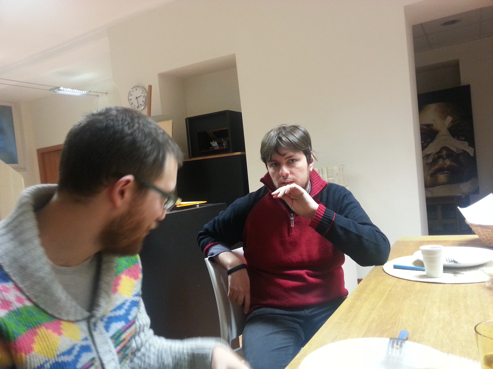

<!-- Questo è un test Questo è un test 
Questo è un test Questo è un test 
Questo è un test Questo è un test 
Questo è un test Questo è un test 
Questo è un test Questo è un test  -->
{: .inizio}

{: .content-image}

#* Distinctive features 

###Kingdom: IOS Developer 
###Phylum: CTO presso Qurami 
###Class: buddy, developer in residence, challenger, gate-keeper  
###Habitat: coding forest 
###Diet: Objective-C / JavaScript / PHP / Software Development / Project Coordination / Product Development / Object Oriented Design / Mobile HTML 5 
###Lifestyle: Pyjama coding, worker-on-rails 
###Most Distintive Feature: he blends in with designers with his unique mac air with a sticker on the back... 
###Biggest Threat: Female Developer 
###Fun Fact: He can handle any kind of hot pepper while talking!

 

#Quote 3:
###"Ho insegnato a mia mamma Face Time...Ho creato un mostro!"

 

#* A short story: 
 Bruno is a iOS freelance developer from Naples, Italy. While many others migrated to Milan, he choose to establish his headquarter in Cuneo, a delightful little town in the inner Piemonte. When we first met Marco Bestonzo, CEO of Intoino, smartly grasping the very concept of Arcadia, Marco said: you guys have to meet Bruno. So we did and Arcadia took off! Since then Bruno has been visiting us at least once per month, settling his mac air in our office for a full day and tirelessly challenging our methodologies, thoughts, projects and, last but not least, supporting and enlarging Arcadia's network!
 
 

#* links:
             http://www.qurami.com/it/index.html
             
             http://appsterdam.rs/

             http://www.thinkfor.it/
            
             http://www.linkedin.com/in/brunobellissimo
{: .fine}

