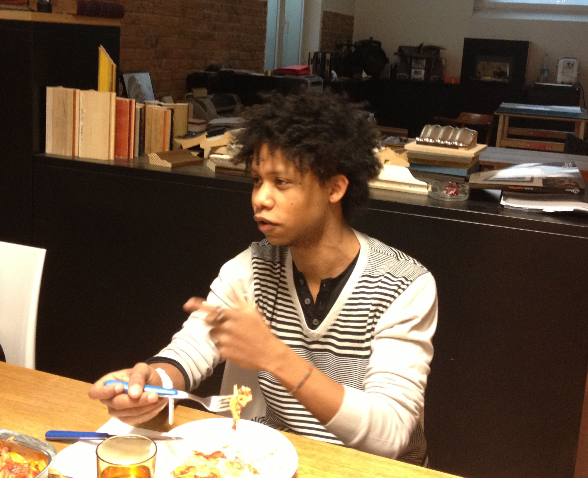

<!-- Questo è un test Questo è un test 
Questo è un test Questo è un test 
Questo è un test Questo è un test 
Questo è un test Questo è un test 
Questo è un test Questo è un test  -->
{: .inizio}

{: .content-image}

#* Distinctive features 

###Kingdom: Marketing 
###Phylum: "WOWCRACY" Founder 
###Class: START-UPPER 
###Habitat: FASHION PEACKS  
###Diet: 
###Lifestyle:  
###Most Distintive Feature: DIPLOMATIC ATTITUDE TOWARDS DREAMY FASHION DESIGNERS WITH LOW ENTREPRENEURIAL APPROACH 
###Biggest Threat: 50 CENT AS INVESTOR 
###Fun Fact: 
 

#* A short story: Lucas is part of the Wowcracy founding team, a new start-up dealing with crowdfounding in the fashion world! We got in touch thanks to the Arcadia network (it does work then!) and we've invited him for some lasagna-sharing, eager to learn more about his experience. The project set off on Sept. 2011 and so far they have faced with courage and smartness all the challanges on the way. Starting with a good press engagement and now going through a demanding backend job to make everything possible, they are already looking forward new opportunities to come. The launch is set for the end of march and new ideas are on its way, starting with collaborations between musician and fashion designers.
 

#* links: 

       http://www.wowcracy.com/  
       
       http://www.vogue.it/en/talents/contests-and-more/2012/11/wowcracy
{: .fine}

