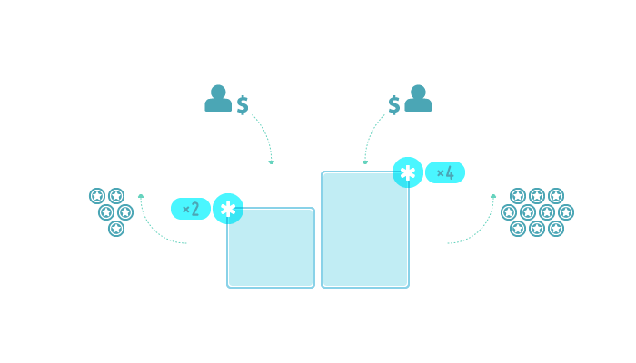
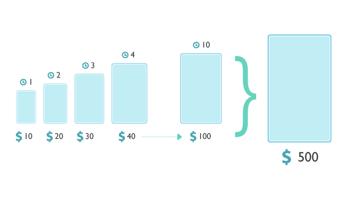
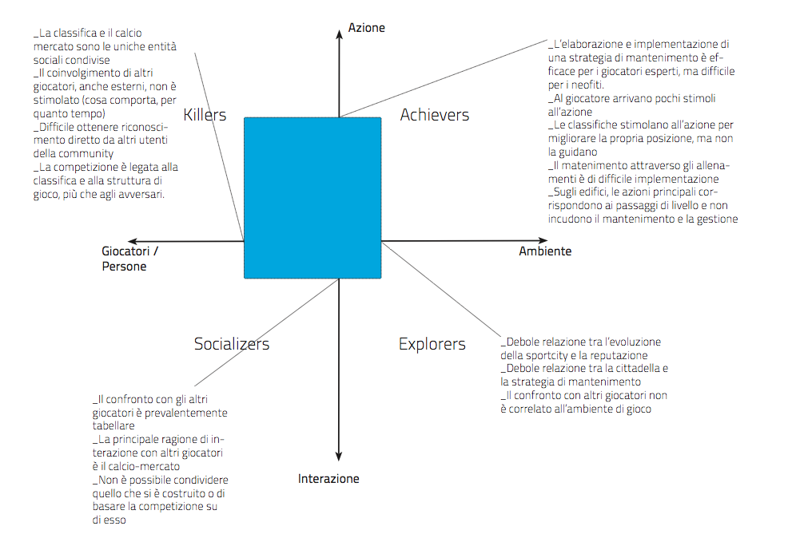

 

### WHAT THE HELL ARE WE DOING HERE?
# GOOD QUESTION!

> "Ciao Pier, Io e Stefano ci domandavamo se possiamo fare della gamification su tacatì o se è solo cosa da social network e adolescenti. Possono esserci spunti interessanti per noi all'evento dell'11?"

### HERE YOU GO...
# GAMES

***

### HERE YOU GO....
# GAMES?

***
### GAME'S TRIGGERS
# GAMIFICATION

Jane McGonigal
`+ goal`
`+ rules`
`+ feedback`
`+ voluntary participation`

> “Playing a game is the voluntary attempt to overcome unnecessary obstacles.”

Bernard Suits, The Grasshopper: Games, Life and Utopia. 

***
### GAMIFICATION FLOW ZONE
# BETWEEN BOREDOM AND BURNOUT

Design challenge

`To design a system of feedbacks suitable to trigger `
`positive feelings and happiness`

> “we feel happy if we liven up our time, rather than kill it”
Game vs depression. 

> “Attention, gratification, motivation and memory.”
Activation of neurological and physical systems. 

> “No pressure nor fatigue.”

***
### GAMIFICATION
# FEEDBACKS ARE KEY

Internal

`Are intimate part of the user experience`
 
`Infinite flow vs interruption (win / lose)`
 
`Social connection`
 
`Serendipity`

> “Virality is build in products”
Seth Godin

External

`points`
`levels`
`challenges`
`leaderboards`
`rewards / badges`
`....`

***
### EXTERNAL FEEDBACKS - EXAMPLE
# CROWDFUNDING PLATFORM FOR SOCIAL PROJECTS

Explored game mechanics: SAPS

`Status`
`Access`
`Power`
`Stuff`

***
###Status: X factor

###Access: Categorization by size

From local to global

### Power: Red Button

### Stuff: Step by Step

***

### EXTERNAL FEEDBACKS - EXAMPLE
# CLASSICS

### The boyscout and the army

### Precius metal market

### Stage of mastery

***

### GAME BEHAVIOURS AND PERSONA
# KILL THE SOCIALIZERS

Bartle's player types
`Killers (20%)`
`Socializers (80%)`
`Explorers (50%)`
`Achievers (40%)`

### Example! SoccerSquare

A game with improvable gamification (before redesign!)

### After redesign

***

### EXTERNAL FEEDBACKS AND ...
# BUSINESS MODEL

Gamification based advertising model

***
### FROM EXTERNAL TO INTERNAL TRIGGERS
# ANSQUARE!

***
### FROM EXTERNAL TO INTERNAL TRIGGERS
# PINTEREST?

***

### INTERNAL TRIGGERS
# PINTEREST IS LIKE TETRIS!

Pinterest vs tetris

`No win`
 
`Infinite flow`
 
`Mosaic layout`
 
`Infinite scrolling`
 
`Social discovery`
 
`Serendipity`

***
### INTERNAL TRIGGERS
# UNCONVETIONAL VIEW

> Would you prefer a retweet or a Foursquare badge?

***
Contatti: fabrizio@mirabito.it
we@thedoersproject.com

TWITTER
@fmirabito

@doersproject

WEB
ansquare.com

thedoersproject.com

