### SEO AND UX - A SYNERGIC APPROACH
# HOW DOES GOOGLE WORK?

***

### SEO AND UX
# WHY?

Just SEO
`+ visits`
`+ traffic`
`+ users`
`+ reviews`
`+ data`
`+ $`

Just UX
`+ recurring visits`
`+ conversion rate`
`+ interactions`
`+ referral links`
`+ new content`
`+ community activity`
`+ value`
`+ $`

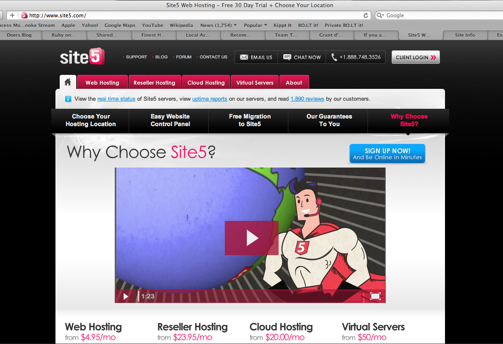
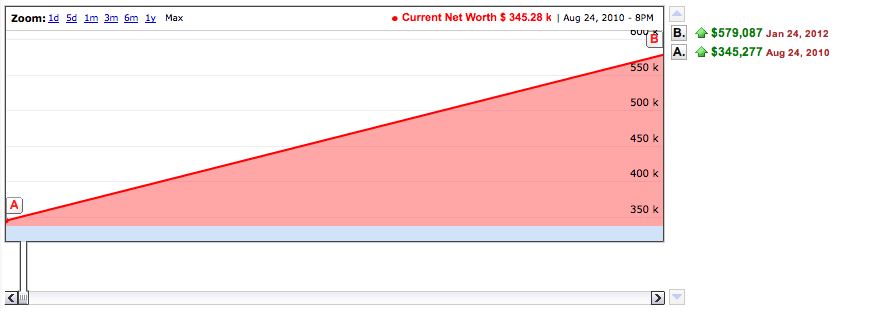

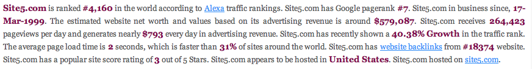

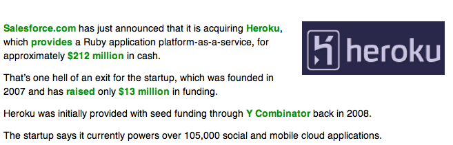

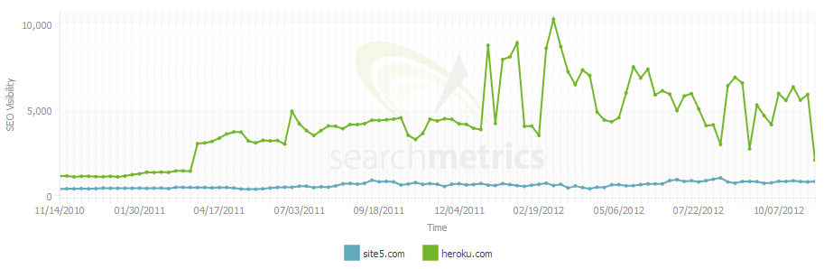

***

### YOU WOULDN'T BELIEVE THAT...
# 5 MYTHS TO BUST

`SMM (Social Media Marketing) is about increasing traffic`
`Anybody deserves to be bothered for a Facebook like`
`Don't invest in market segment already exploited`
`Talk with your customers`
`Code has no taste`

***

### MYTH 1 - SMM (SOCIAL MEDIA MARKETING) IS ABOUT INCREASING TRAFFIC
# SMM BUILDS TRUST

`? Where is my target?`
`? What is the content I want my brand to be linked to?`
`? How do I recover energies spent in SMM?`
`? Why do I want to influence my user flow?`
`# Focus`
`# Community trust`
`# Google trust`

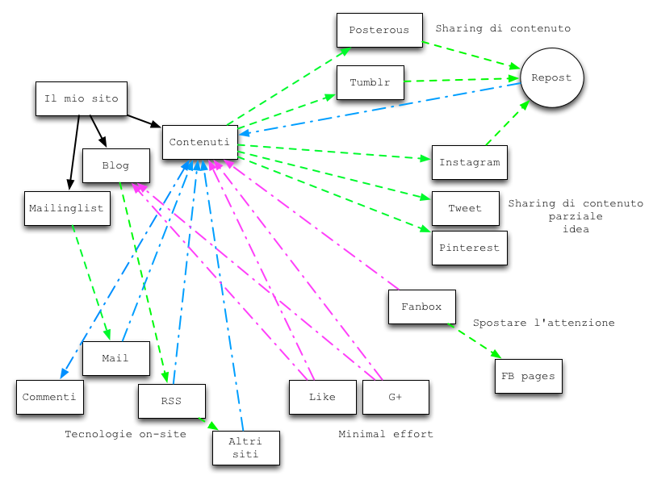

***
### MYTH 2 - ANYBODY DESERVES TO BE BOTHERED FOR A FACEBOOK LIKE
# CONTENT IS KING

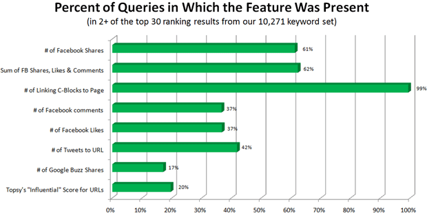

***
### MYTH 3 - DON'T INVEST IN MARKET SEGMENT ALREADY EXPLOITED
# FIND YOUR PERFECT FIT
`@ Shaving;`
`@ High-end fashion;`
`@ GTD;`
`@ Personal finance;`
`@ Hand writing;`

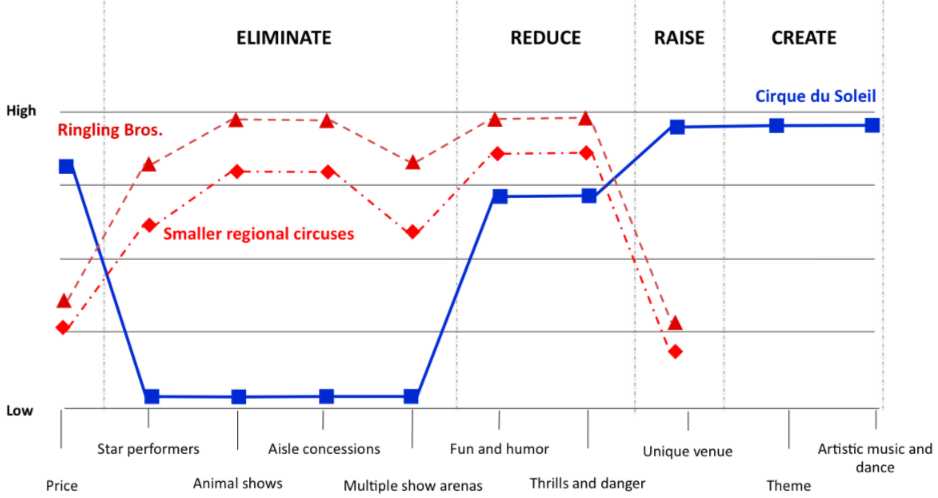

***

### MYTH 4 - TALK WITH YOUR CUSTOMERS
# ADOPT A CONSISTENT STRATEGY

Don't care about them
`@ Clear;`
`@ MoneyWiz;`
Take advantage of them for marketing tactics
`# Samsung;`

## User feedback are key if filtered with a given methodology and integrated into a solid development strategy

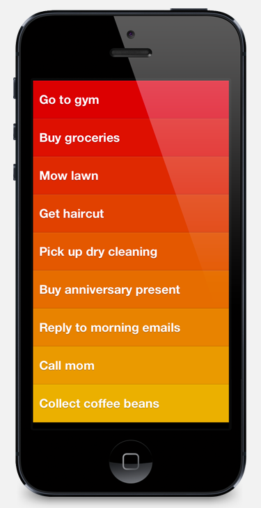

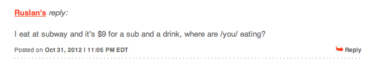
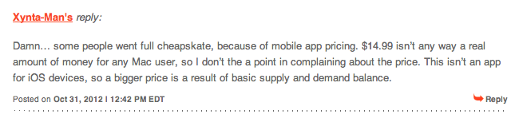

***
### MYTH 5 - CODE HAS NO TASTE
# VANILLA CODE IS TASTY!

Pay attention to
`$ robot.txt`
`$ webmaster tool`
`$ submit to index`
`$ sitemap xml`
`$ tag description`

..and to
`$ h1 title`
`$ pretty url`
`$ alt tag images and video`
`$ flat information architecture`
`$ performances' optimizzion`

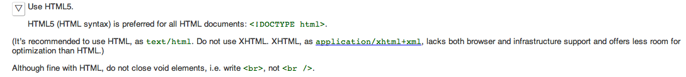

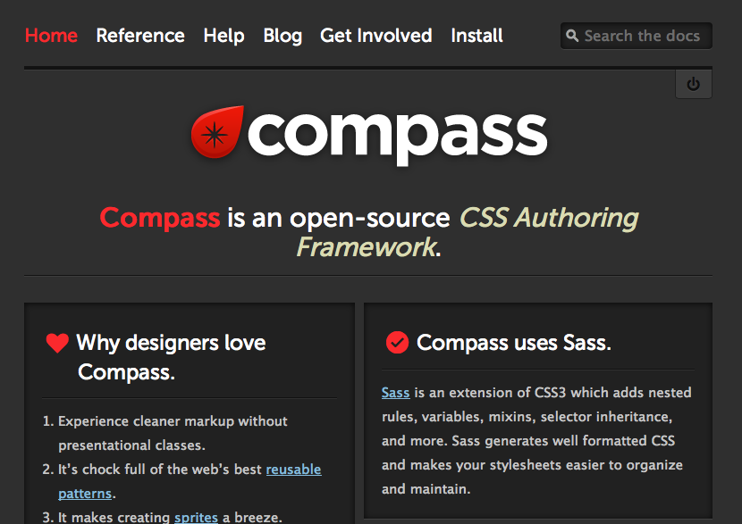

## Contact

claudio.petrarulo@gmail.com
we@thedoersproject.com

