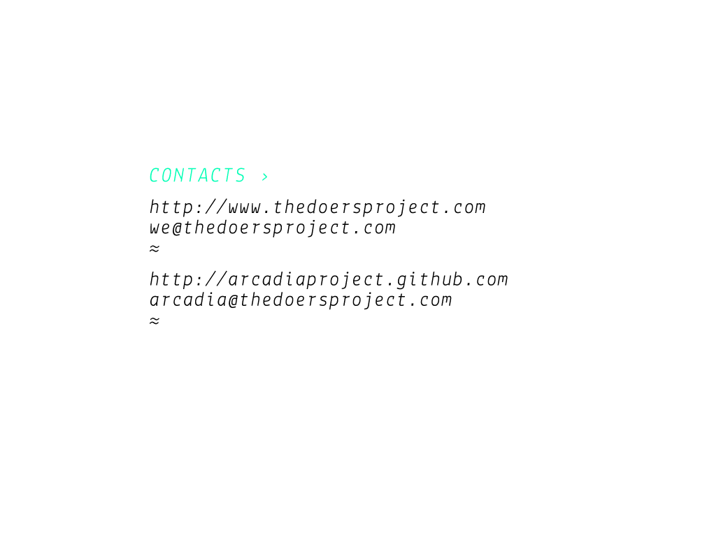

### PRESENTATION:

 

<ul>
  <li>
      <a href="http://rubykoans.com">rubykoans.com</a>
  </li>
  <li>
      <a href="http://mislav.uniqpath.com/poignant-guide/">mislav.uniqpath.com</a>
  </li>
  <li>
     <a href="http://rubymonk.com">rubymonk.com</a>
  </li>
  <li>
     <a href="http://railsforzombies.org">railsforzombies.org</a>
  </li>
  <li>
     <a href="http://h3rald.com/articles/10-reasons-to-learn-ruby/">h3rald.com</a>
  </li>
</ul>

<ul>
  <li>
      <a href="http://cukes.info">cukes.info</a>
  </li>
  <li>
      <a href="http://rspec.info">rspec.info</a>
  </li>
  <li>
     <a href="https://github.com/zmoazeni/csscss">github.com/zmoazeni</a>
  </li>
  <li>
     <a href="https://github.com/Springest/terminal-notifier-guard">github.com/Springest</a>
  </li>
  <li>
     <a href="https://github.com/guard/guard-livereload">github.com/guard</a>
  </li>
  <li>
     <a href="https://github.com/guard/guard">github.com/guard/guard</a>
  </li>
</ul>

<ul>
  <li>
      <a href="http://gembundler.com/v1.3/gemfile.htm">gembundler.com</a>
  </li>
  <li>
      <a href="https://rubygems.org">rubygems.org</a>
  </li>
  </ul>

<ul>
  <li>
      <a href="https://www.ruby-toolbox.com">ruby-toolbox.com</a>
  </li>
  <li>
      <a href="http://www.plugingeek.com">plugingeek.com</a>
  </li>
  <li>
     <a href="http://www.ruby-lang.org">ruby-lang.org</a>
  </li>
  <li>
     <a href="http://www.jetbrains.com/ruby/">jetbrains.com/ruby</a>
  </li>
  <li>
     <a href="https://codeclimate.com">codeclimate.com</a>
  </li>
 </ul>

<ul>
  <li>
      <a href="https://www.engineyard.com">engineyard.com</a>
  </li>
  <li>
      <a href="https://www.heroku.com">heroku.com</a>
  </li>
</ul>

<ul>
  <li>
      <a href="http://blog.idyllic-software.com/blog/bid/206209/Why-Entrepreneurs-Love-Ruby-on-Rails-for-Web-Development">blog.idyllic-software.com</a>
  </li>
  <li>
      <a href="http://www.quora.com/Y-Combinator/Why-do-many-Y-Combinator-companies-use-Ruby-on-Rails">quora.com/Y-Combinator</a>
  </li>
  <li>
     <a href="http://www.quora.com/Ruby-on-Rails/Why-do-so-many-startups-use-Ruby-on-Rails">quora.com/Ruby-on-Rails</a>
  </li>
  <li>
     <a href="http://stackoverflow.com/questions/1586601/why-are-ruby-projects-so-dominant-at-github">stackoverflow.com</a>
  </li>
</ul>

### PRESENTATION WE LAIKA:

  	
  	
  	

	
  	
  	

